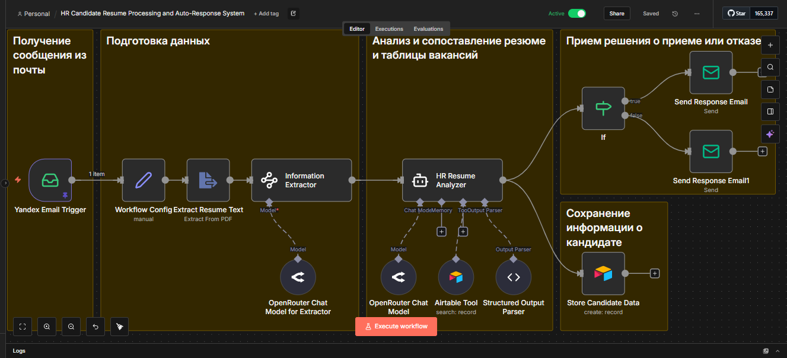
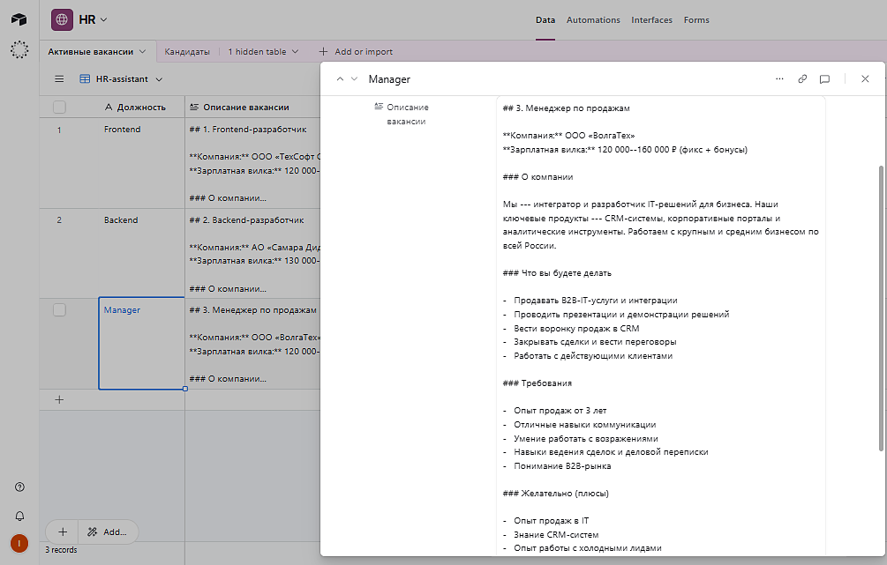
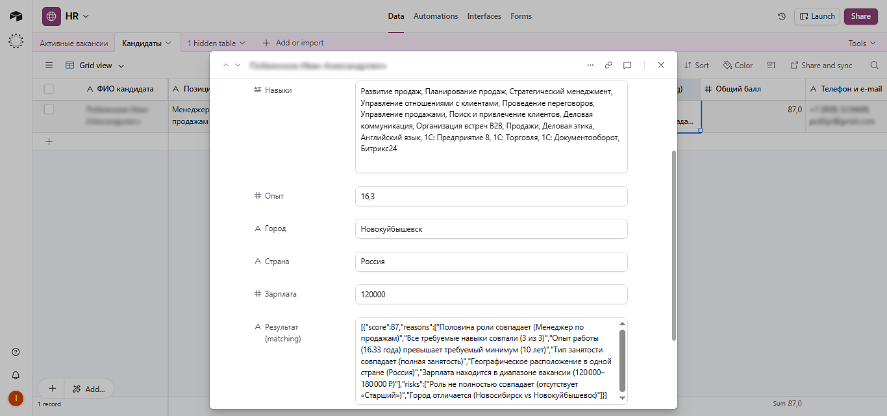
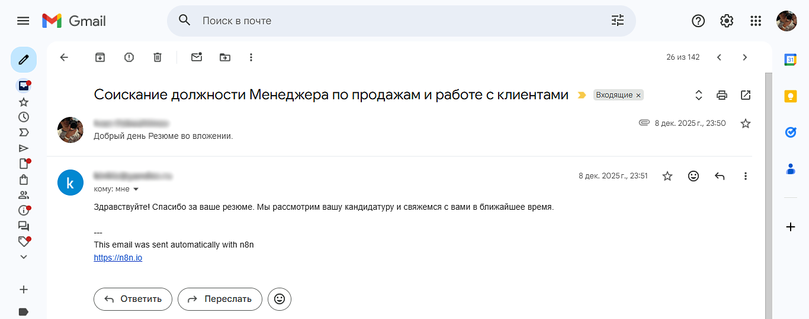

<div align="center">

# 📋 HR Candidate Resume Processing and Auto-Response System

[](https://n8n.io/)

Система автоматической обработки резюме кандидатов: извлечение данных, матчинг с вакансиями и отправка ответов.

</div>

---

## 📋 Описание

Система автоматически:

1. **Получает письма** с резюме на почту Yandex
2. **Извлекает текст** из PDF-файлов резюме
3. **Анализирует данные** кандидата (ФИО, опыт, навыки, зарплата)
4. **Сопоставляет с вакансиями** из Airtable
5. **Сохраняет кандидатов** в Airtable
6. **Отправляет ответ** кандидату (принят/отказ)

> Примечание: Активные вакансии в Airtable были сгенерированы с помощью ChatGPT для тестирования системы.
---

## 🛠 Технологии

- **n8n** — платформа автоматизации
- **Yandex Mail** — получение писем с резюме
- **Airtable** — база вакансий и кандидатов
- **OpenRouter** — AI для анализа резюме

---

## 📦 Установка

### 1. Клонируйте репозиторий

```bash
git clone https://github.com/your-username/hr-resume-processor.git
cd hr-resume-processor
```

### 2. Настройте переменные окружения

```bash
cp .env.example .env
# Отредактируйте .env и добавьте ваши API-ключи
```

### 3. Импортируйте workflow в n8n

1. Откройте ваш n8n instance
2. Перейдите в Settings → Import
3. Загрузите файл workflow.json
4. Создайте credentials в n8n:
   - IMAP — для Yandex почты
   - SMTP — для отправки писем
   - OpenRouter Api — для AI
   - Airtable OAuth — для Airtable

---

## 📁 Структура проекта
```
hr-resume-processor/
├── .gitignore           # Исключение чувствительных файлов
├── .env.example         # Шаблон переменных окружения
├── README.md            # Документация
├── workflow.json        # n8n workflow
└── docs/
    └── images/          # Скриншоты и медиа
```

## 📸 Скриншоты
### Workflow в n8n


### Структура Airtable




### Пример обработки резюме и ответа кандидату


## 🔧 Workflow Overview
```
Yandex Email → Extract Resume Text → Information Extractor
                                           ↓
                          OpenRouter Chat Model for Extractor
                                           ↓
                              HR Resume Analyzer ← Airtable Tool
                                           ↓
                         Structured Output Parser
                                           ↓
                    ┌──────────────┬──────────────┐
                    ↓              ↓              ↓
              Store Candidate    If (score≥60)   Send Response Email
                    ↓              ↓              ↓
              Airtable     Send Response    Send Response Email1
                              (positive)      (negative)
```

## 🤝 Contributing

1. Forkните репозиторий
2. Создайте ветку (git checkout -b feature/amazing-feature)
3. Commitните изменения (git commit -m 'Add amazing feature')
4. Pushните в ветку (git push origin feature/amazing-feature)
5. Откройте Pull Request

## 📄 Лицензия

MIT License

## 🙏 Благодарности

- [n8n](https://n8n.io/) — за мощную платформу автоматизации
- [OpenRouter](https://openrouter.ai/) — за доступ к LLM
- [Airtable](https://airtable.com/) — за удобную базу данных
- [Yandex Mail](https://mail.yandex.ru/) — за почтовый сервис

---

<div align="center">
Сделано с ❤️
</div>
